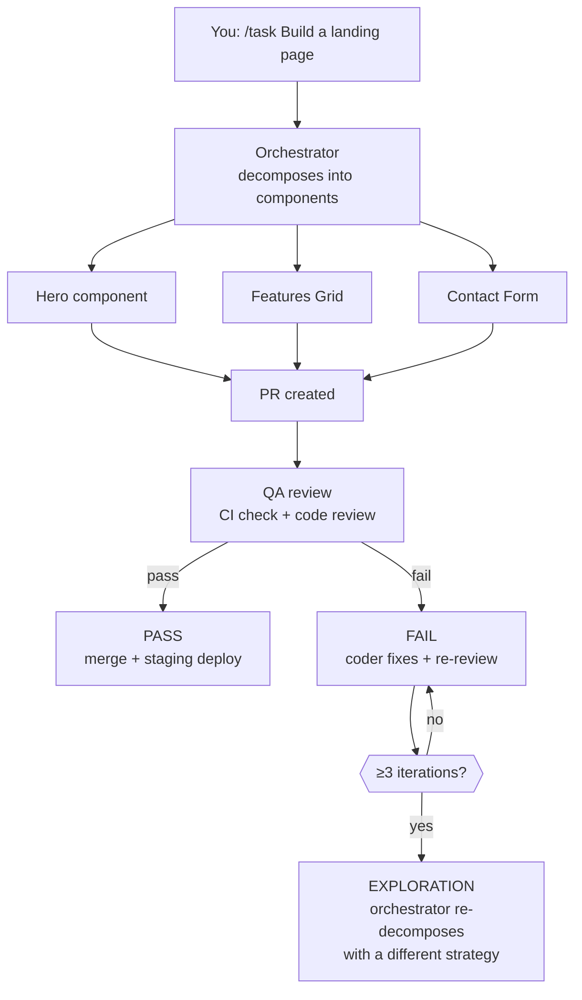

# Hermes Coder Deploy

You send a task to Telegram. Four AI agents pick it up, break it into pieces, build it, review it, and ship it — with a human approval gate before anything goes to production.

This is a multi-agent development system built on [Hermes Agent](https://github.com/NousResearch/hermes-agent). A dispatcher decomposes work, a coder builds it, QA reviews and merges it, and a Telegram bot lets you steer the whole thing from your phone. Every agent has memory: rules are cached per project, and the system learns from its mistakes — storing verified patterns as templates and failed approaches as anti-patterns so they are never repeated.

## 🔄 How a Task Flows

Everything starts with a Telegram message. Here's what happens next:



**Release and deploy** follow their own paths:
- `/release` → QA opens a PR from `dev` to `main` → blocked until you approve → merge → build → GitHub Release
- `/deploy-ftp` → QA downloads the release zip → FTP to your server

## 🧠 Memory Layer

The system has two kinds of memory. Think of it as a filing cabinet with two drawers: one for rules that never change, and one for lessons learned.

### Layer 1: Project Rules (the filing cabinet)

The orchestrator reads your project's `AGENTS.md` and `SOUL.md` on first run, extracts the key conventions (coding style, testing patterns, API standards), and caches them in the memory database keyed by git commit hash. On the next task, it checks whether the hash has changed — if not, it uses the cache. Coder and QA agents recall these rules before every task. Disk files are always the fallback.

### Layer 2: Experience (the lessons notebook)

- **Recall** before executing: the agent searches for similar past solutions, patterns, and pitfalls.
- **Remember** after success: compressed summaries of what worked (never raw source code).
- **Anti-patterns**: known failures are stored and recalled before execution — so the same mistake is never repeated.
- **Exploration**: after 3 failed review iterations, the system stores what went wrong and escalates to the orchestrator for a different decomposition strategy.
- **Self-correction**: when an agent's own recalled evidence turns out to be wrong, it retracts it. Each agent can only modify its own records — ownership is enforced.

**All memory calls are best-effort — a memory failure never blocks a task.**

### Stack

`memory-db` (PostgreSQL 18 + pgvector) → `embedding` (TEI `all-MiniLM-L6-v2`, 384-dim) → `dense-mem` (MCP `:8080/mcp`, control portal `:8090`).

## ✅ Design Principles

These are the patterns that make the system work. Each one exists because a specific problem demanded it.

| Principle | Why it exists |
|-----------|---------------|
| **Decompose before build** | Orchestrator breaks tasks into 2–8 components with acceptance criteria before the coder writes a line. Smaller pieces mean faster reviews and fewer merge conflicts. |
| **Parallel on shared branches** | Component sub-tasks run on separate worktrees of the same branch. Parallel speed, single-branch coherence. |
| **Three-tier quality gate** | Coder self-checks (4-dimension rubric) → QA reviews → pr-judge scores. High scores become templates; low scores become anti-patterns. The system gets sharper with every PR. |
| **Memory is best-effort** | Rules cache and experience recall enhance context but never block execution. A memory failure degrades gracefully — the agent still works, just with less context. |
| **Ownership-based memory** | Each agent can only modify its own records. The coder cannot overwrite QA's evidence. Dense-mem enforces this at the database level. |
| **Human-in-the-loop** | Production deploys and main-branch merges require explicit `/unblock`. No silent deploys, no surprise releases. |
| **Exploration on repeated failure** | After 3 failed review iterations, the system stops the fix loop and escalates to the orchestrator for a fundamentally different approach. |
| **Role-based tool access** | Each profile whitelists which MCP tools it can call. The coder cannot trigger deploys; the QA cannot rewrite project rules. |
| **Telegram-first control** | Every operation — task creation, release, deploy, approval — is accessible from Telegram. The phone is the control panel. |
| **Retry with classification** | Failed operations are classified as transient (retry 3x with backoff) or permanent (fail immediately). No wasted retries on guaranteed failures. |
| **Priority scoring** | Tasks carry a composite score (type weight + age + iteration penalty + dependency bonus). The most urgent work surfaces first; old tasks age out of starvation. |
| **Progressive skill loading** | The agent sees a compact skill catalog at session start and only loads full instructions when a task matches. Keeps context lean for routine operations. |

## 🐳 Architecture

Four containers, one shared volume, one memory stack. The volume (`hermes-data`) holds the Kanban database and agent memory — it is the only way the containers communicate.

### Workers

| Service | Profile | Role | Command | Skill |
|---------|---------|------|---------|-------|
| **dispatcher** | dispatcher | `orchestrator` | `hermes kanban work --loop` | `orchestrate-task` |
| **coder** | coder | `developer` | `hermes kanban work --loop --skip_context_files` | `execute-task` |
| **qa** | qa | `qa` | `hermes kanban work --loop` | `execute-qa-task` |
| **telegram-bot** | dispatcher | — | `hermes gateway run --gateway telegram` | `command-handler` |

### Memory Stack

| Service | Command | Purpose |
|---------|---------|---------|
| **memory-db** | PostgreSQL + pgvector | Durable memory store |
| **embedding** | TEI `all-MiniLM-L6-v2` (port 8081) | Embeddings for RAG |
| **dense-mem** | MCP memory server (`:8080/mcp`, control portal `:8090`) | RAG E-pool |

Workers start only after `dense-mem` is healthy. The Telegram bot runs a background process that polls blocked tasks every 30 seconds and sends you a reminder when human approval is needed.

## 🧠 Skills

Each skill is a Markdown instruction file — the agent loads it on demand and follows the procedure inside. Skills live in `profiles/<profile>/skills/<skill-name>/SKILL.md`.

### dispatcher
- **command-handler** — Telegram gateway: `/task`, `/ask`, `/feedback`, `/project add`, `/status`, `/cancel`, `/release`, `/deploy-ftp`, `/unblock`, `/help`. Stamps initial priority score on task creation. Detects refactoring tasks from keywords.
- **orchestrate-task** — decomposes tasks into component sub-tasks (UI / content / integration) with acceptance criteria, coordinates a shared branch and final PR task. Recalls anti-patterns before decomposing; handles exploration re-decomposition.
- **prioritize-tasks** — composite scoring (type + aging + iterations + unblocking). Advisory metadata for operators.

### coder
- **execute-task** — dispatches to: component execution, project init, PR creation, or review-fix loop. Routes `type: review` to `references/review-fix.md`.
- **create-pr** — validation, commit, push, PR creation to `dev`.
- **project-init** / **setup-ci** — project initialization (links Vercel for staging).
- **frontend-stack** — reference hub for the standardized stack (15 library references via `skill_view`).
- Specialized: **ui-architect**, **ui-implementer**, **content-strategist**, **integration-specialist**, **technical-planner**, **narrative-designer**, **simple-task-executor**, **threejs-scene-builder**.

### qa
- **execute-qa-task** — dispatches by type: `review` → review-and-merge (loops coder↔QA), `release` → release-to-main (HITL gate), `deploy` → deploy-ftp. Triggers exploration escalation after ≥3 review iterations.
- **review-and-merge** — CI check (10 min wait), code review, squash merge to `dev`, Vercel staging deploy.
- **release-to-main** — PR dev→main, blocked for human approval, merge after `/unblock`, build, GitHub Release.
- **deploy-vercel** / **deploy-ftp** — staging and production deploys.
- **pr-judge** — scores PRs 1–10, feeds verified templates and anti-patterns to the memory layer.
- **resolve-merge-conflict** — automatic resolution via `git merge --strategy-option theirs`.

## 🧱 Core Stack

Installed by `project-init`. All development targets this stack only.

| Component | Purpose |
|-----------|---------|
| React + TypeScript | UI + typing |
| Vite | Build tool |
| Zustand | State management |
| MUI | UI components |
| React Hook Form + Zod | Forms + validation |
| TanStack Query | API fetching + caching |
| React Router | Routing |
| GSAP + Three.js/R3F | Animations + 3D |
| Vitest + MSW | Testing + API mocking |
| Biome | Linter + Formatter |
| Storybook | Component docs |

## 🔐 Secrets

One plain file per value in `secrets/` (gitignored). `make init` creates empty placeholders.

- Compose mounts each into `/run/secrets/<name>` (K8s-style file mount, **not encrypted**).
- `load-secrets.sh` implements Docker `*_FILE` convention. Fails fast on missing files.
- `check-secrets.sh` (run by `make up` / `make setup`) validates required secrets are non-empty.
- Required: `token`, `telegram_allowed_chats`, `github_token`, `openai_api_key`, `postgres_password`, `control_portal_token`, `ai_verifier_api_key`. Optional: `ftp_*`, `vercel_token`, `vercel_org_id` / `vercel_project_id`.
- `dense_mem_{dispatcher,coder,qa}` are **generated automatically** by `make setup` — do not fill manually.

## 🚀 Deployment

### First deploy

```bash
make init                              # create secrets/ placeholders
# fill required secrets (see above)
printf '%s' '<token>'                  > secrets/token
printf '%s' '<chat_id>'                > secrets/telegram_allowed_chats
printf '%s' '<github_pat>'             > secrets/github_token
printf '%s' '<deepseek_api_key>'       > secrets/openai_api_key
printf '%s' '<pg_password>'            > secrets/postgres_password
printf '%s' '<portal_token>'           > secrets/control_portal_token
printf '%s' '<deepseek_api_key>'       > secrets/ai_verifier_api_key
make setup                             # start stack + generate memory keys
make logs                              # verify all 7 services are up
```

### Ongoing

```bash
make up                                # start (validates secrets first)
make restart                           # force-recreate all containers
make logs                              # tail logs
make down                              # stop all containers
make update-profiles                   # hot-reload skills in running containers
```

### Vercel staging (automatic)
Every PR merged by QA to `dev` → `deploy-vercel` creates a staging preview. `project-init` links Vercel automatically when `VERCEL_TOKEN` is set.

### Production FTP (on demand)
`/deploy-ftp <project>` → QA downloads latest GitHub Release zip → FTP to server. Requires `ftp_*` in `secrets/`.

### Server setup (Timeweb Cloud)
1. Paste `cloud-init.sh` into server creation.
2. SSH in, fill secrets (see First deploy above).
3. `make setup`.

## 📊 Eval & Observability

### Metrics

| Metric | Source |
|--------|--------|
| Task Success Rate (TSR) | `done` / total tasks |
| TSR Drift | 7-day rolling avg vs today (alert if >10% drop) |
| Cost Proxy | Steps + retries from `[outcome=success]` tags |
| Review Iterations | `task_runs` distinct profile count per review task |
| Per-type Success Rate | `GROUP BY metadata.type` |
| pass@k | Consecutive `done` streak |
| Prioritization | Scored ready tasks count |
| Exploration | Trigger count + high-iteration tasks (≥3 rounds) |

### Structured outcome logging

```bash
kanban_complete --comment "[outcome=success] <summary> | steps=<N> | retries=<N>"
```

### Daily stats

```bash
make daily-stats  # requires TELEGRAM_CHAT_ID env var or argument
```

Sends to Telegram: task counts, completed/blocked lists, memory stats, trajectory warnings, cost proxy, TSR drift, per-type breakdown, pass@k, prioritization, exploration triggers. Cron:
```
0 9 * * * cd /root/hermes-coder-deploy && TELEGRAM_CHAT_ID=<id> make daily-stats
```
